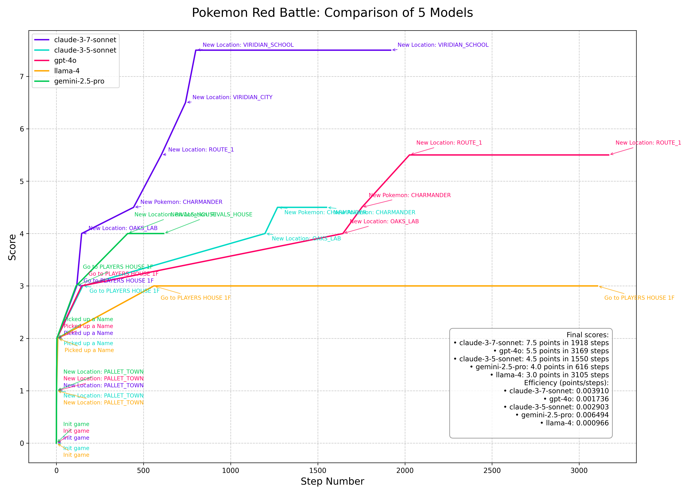

# PokemonGym   
<div align="center">
  <a href="https://discord.gg/mZ9Rc8q8W3" target="_blank">
    
  </a>
  <p>
    A server for evaluating AI agents on Pokemon Red gameplay.
  </p>
  
</div>




## Overview

PokemonGym is a platform that allows AI agents to play Pokemon Red through a server-client architecture. The system includes:

- **[Evaluator](./evaluator/README.md)**: Evaluation metrics and scoring system for Pokemon Red gameplay
- **[Server](./server/README.md)**: FastAPI server that controls Pokemon Red emulation and exposes game state via API
- **[Agents](./agents/README.md)**: Implementation of AI and human agents that interact with the evaluator server
- **[Results](./results/README.md)**: Evaluation results comparing different AI models playing Pokemon Red

## Quick Start

1. **Install dependencies:**
   ```bash
   pip install -r requirements.txt
   ```

2. **Place Pokemon ROM:**
   Place your Pokemon Red ROM file in the root directory and name it `Pokemon_Red.gb`

3. **Start the evaluator server:**
   ```bash
   python -m server.evaluator_server
   ```

4. **Run an agent:**
   ```bash
   # Run AI agent
   python agents/demo_agent.py
   
   # OR run human interface
   python agents/human_agent.py
   ```

5. **Run the automated evaluation:**
   ```bash
   bash run.sh
   ```

## Installation

### Prerequisites

- Python 3.8+
- PyBoy and its dependencies
- Pokemon Red ROM file (not included)

### Setup

1. Clone the repository:
```bash
git clone https://github.com/yourusername/PokemonGym.git
cd PokemonGym
```

2. Install dependencies:
```bash
pip install -r requirements.txt
```

3. Place your Pokemon Red ROM file in the root directory and name it `Pokemon_Red.gb`

4. Set API keys for AI agents:
```bash
export ANTHROPIC_API_KEY=your_anthropic_key_here  # For Claude
export OPENAI_API_KEY=your_openai_key_here        # For GPT-4o
export OPENROUTER_API_KEY=your_openrouter_key_here  # For Llama
export GOOGLE_API_KEY=your_google_key_here        # For Gemini
```

## Repository Structure

```
PokemonGym/
├── server/                # Server implementation
│   ├── evaluator_server.py  # FastAPI server implementation
│   └── README.md            # Server documentation
├── evaluator/             # Evaluation metrics and scoring system
│   ├── evaluate.py          # Evaluation metrics implementation
│   ├── milestones.py        # Game milestones and scoring definitions
│   └── README.md            # Evaluator documentation
├── agents/                # Agent implementations
│   ├── demo_agent.py        # AI agent implementations
│   ├── human_agent.py       # Human interface agent
│   └── README.md            # Agents documentation
├── results/               # Evaluation results and comparisons
│   ├── comparison_plot.png  # Visual comparison of model performance
│   └── README.md            # Results documentation
├── pokemon_env/           # Environment utilities
├── gameplay_sessions/     # Session data storage
├── evaluate.py            # Main evaluation script
├── run.sh                 # Bash script for running evaluation
└── README.md              # Main documentation
```

## Running the Evaluator Server

Start the evaluation server:

```bash
python -m server.evaluator_server
```

The server will start at http://localhost:8080 by default.

Options:
- `--host`: Host to run the server on (default: 0.0.0.0)
- `--port`: Port to run the server on (default: 8080)
- `--rom`: Path to the Pokemon ROM file (default: Pokemon_Red.gb)
- `--log-file`: Custom CSV filename (optional)

## Running Agents

### AI Agent

The demo AI agent uses Claude to make decisions based on the game screen:

```bash
python agents/demo_agent.py
```

First, set your Anthropic API key:
```bash
export ANTHROPIC_API_KEY=your_api_key_here
```

Options:
- `--server`: Server URL (default: http://localhost:8080)
- `--steps`: Number of steps to run (default: 1000000)
- `--headless`: Run in headless mode
- `--sound`: Enable sound (requires non-headless mode)
- `--provider`: AI provider to use (claude, openai, gemini, openrouter)
- `--model`: Model to use (default depends on provider)
- `--temperature`: Temperature for model generation (default: 1.0)
- `--max-tokens`: Max tokens for response (default: 4000)
- `--log-file`: File to save agent logs (default: agent_log.jsonl)
- `--load-state`: Path to a saved state file to load
- `--load-autosave`: Load the latest autosave
- `--session`: Session ID to continue a previous session

### Human Agent

Play Pokemon Red yourself with keyboard controls:

```bash
python agents/human_agent.py
```

Options:
- `--server`: Server URL (default: http://localhost:8080)
- `--sound`: Enable sound (requires non-headless mode)
- `--load-state`: Path to a saved state file to load
- `--load-autosave`: Load the latest autosave
- `--session`: Session ID to continue a previous session

### Controls

- Arrow Keys: Move
- Z: A button
- X: B button
- Enter: Start button
- Right Shift: Select button
- Space: Wait (advances a few frames)
- F5: Save current state
- F7: Load last saved state

## Automated Evaluation

You can run an automated evaluation using the provided run.sh script:

```bash
bash run.sh
```

This script runs the evaluation for a specified duration (default: 1 minute) and outputs results to the `evaluation_sessions/latest_evaluation` directory.

Options (set as environment variables):
- `INTELLIGENCE_URL`: URL of the AI agent (default: http://localhost:8000)
- `MAX_DURATION`: Duration of the evaluation in minutes (default: 1)

Example with custom settings:
```bash
INTELLIGENCE_URL=http://localhost:9000 MAX_DURATION=5 bash run.sh
```

## Game State Management

### Continuing Sessions

To continue from a previous session by specifying the session ID:

```bash
# Human agent with session
python agents/human_agent.py --session session_20250404_180209

# AI agent with session
python agents/demo_agent.py --session session_20250404_180209
```

### Loading Specific States

Load from a specific state file:
```bash
python agents/human_agent.py --load-state gameplay_sessions/session_20250404_180209/final_state.state
python agents/demo_agent.py --load-state gameplay_sessions/session_20250404_180209/final_state.state
```

Load the latest autosave:
```bash
python agents/human_agent.py --load-autosave
python agents/demo_agent.py --load-autosave
```

## Component Documentation

- [**Evaluator Documentation**](./evaluator/README.md): Learn about the evaluation metrics and scoring system
- [**Server Documentation**](./server/README.md): Details about the API server, endpoints, and state management
- [**Agents Documentation**](./agents/README.md): Detailed information on the demo AI agent and human interface
- [**Results Documentation**](./results/README.md): Evaluation results and model comparisons
